# Examples

## Basics

### [Clear Screen](./ClearScreen.cpp)
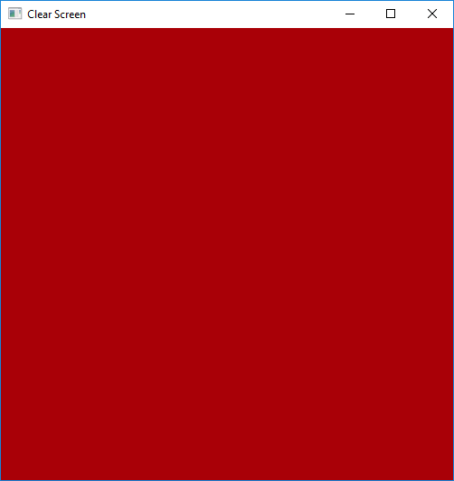

Most basic example to demonstrate the functioning of the Vulkan graphic channel. Simple demo that shows how to change the cleaned color, similar to ```glClearColor``` in Vulkan.

### [Triangle](./TriangleNoBuffer.cpp)
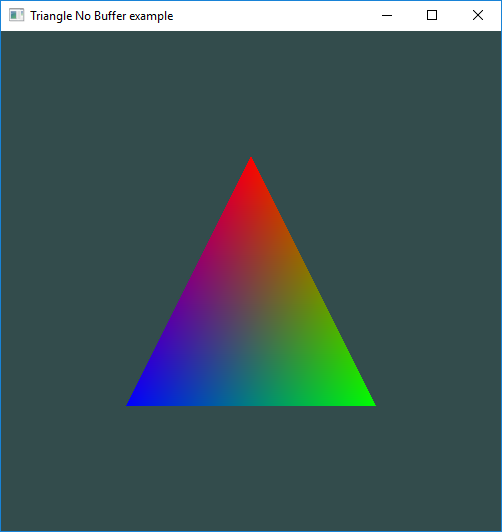

Extending the example of [Clear Screen](./ClearScreen.cpp), this demo shows you how to create your first Graphic Pipeline in order to draw a triangle, whose vertices are hard-coded in the vertex shader.

### [Triangle tesselated](./TriangleIndexed.cpp)
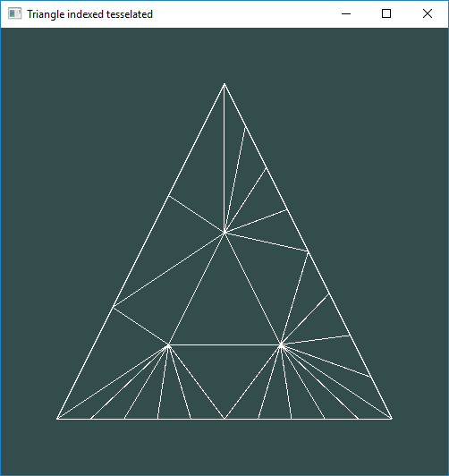

Demo that shows how to paint a triangle using or not indexing (``` #define INDEXING_MODE ```). It also allows you to paint a triangle using the tesselation technique ( ```#define TESS_MODE``` ).

We can change the way to draw the commented triangle or by decomposing the definition of the variables ```INDEXING_MODE``` to draw an indexed triangle and ```TESS_MODE``` which applies the technique of tiling using a wireframe mode to check the new vertices generated.

### [Cube Textured](./CubeTextured.cpp)
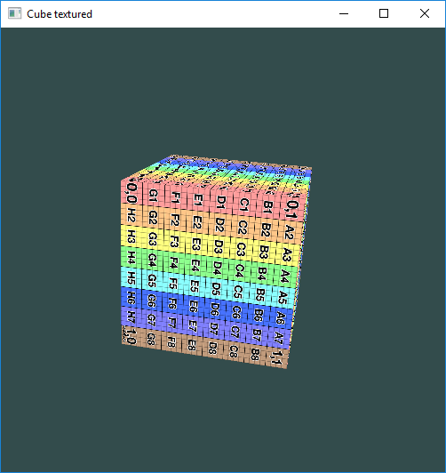

Basic application that shows how to create two buffers in GPU memory using staging buffer and a 2D texture in order to draw an indexed cube with texture.


## Advanced
### [Sampler as an uniform](./SamplerUniformQuad.cpp)
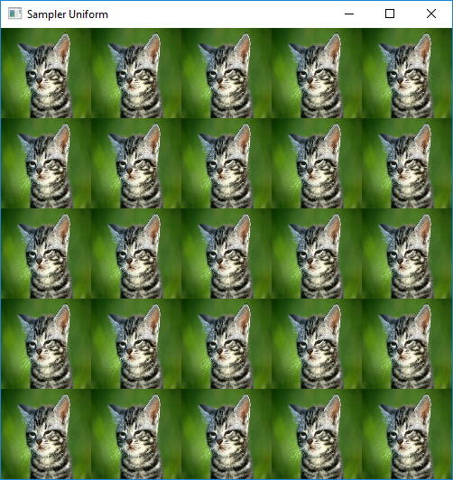

In this example we demonstrate how to paint a full-screen plane in order to demonstrate how to use sampler-type variables as a uniform within the pipeline and descriptor.


### [Secondary Buffer Quad](./SecondaryBuffer.cpp)
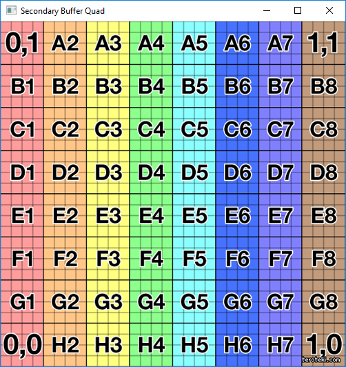

Basic example to demonstrate how to generate secondary CommandBuffer which facilitates the refactoring of CommandBuffer.

Before starting the rendering and update loop we generated this secondary CommandBuffer recording the Pipeline bind, descriptors and the painting. Finally, in the rendering loop the main CommandBuffer is the one that will execute all the secondary CommandBuffer.


### [Skybox with refraction and reflection](./Skybox.cpp)
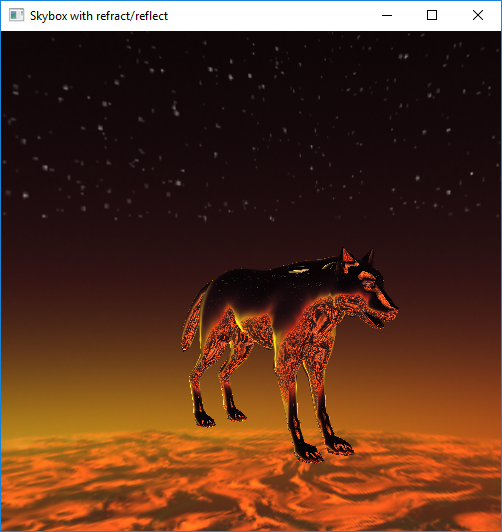

Demo that shows a skybox next to a model on which the reflection and refraction technique is applied (with the ```Z``` and ```X``` keys).

The model is loaded through the [assimp](https://github.com/assimp/assimp) library, which allows the loading of meshes in different formats, such as .OBJ and .PLY.


### [Planar reflection with Stencil Buffer](./PlanarReflection.cpp)
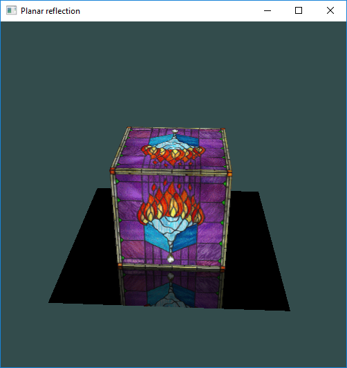

Demo that recreates the technique of planar reflection using the stencil buffer. This kind of buffer is an optional extension of the depth buffer that gives you more control over the question of which fragments should be drawn and which shouldn't.

Like the depth buffer, a value is stored for every pixel, but this time you get to control when and how this value changes and when a fragment should be drawn depending on this value. Note that if the depth test fails, the stencil test no longer determines whether a fragment is drawn or not, but these fragments can still affect values in the stencil buffer!


### [Plane instancing with blending](./Instancing.cpp)
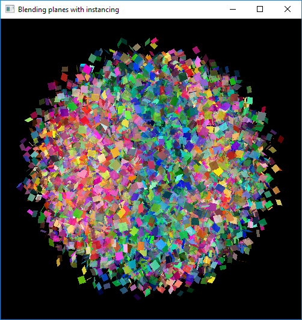

This demo shows a series of planes indexed and instantiated with active blending. Thanks to the instantiation technique we can draw a greater amount of geometry in a single call.


### [Matcap with 2D array](./Matcap2DArray.cpp)
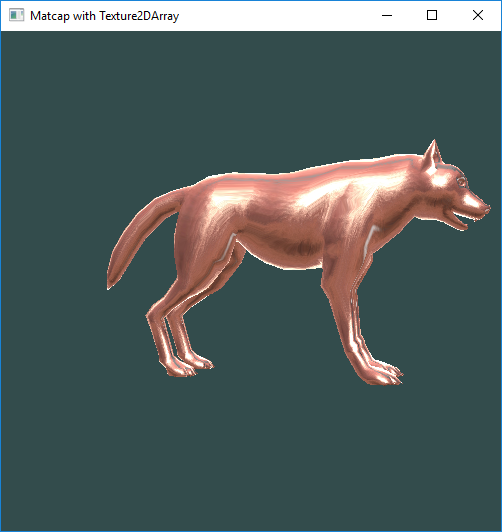

Application that shows how to apply different Matcap using a 2D Array texture. This type of texture requires that all images have the same size.


### [Pipeline Derivation with SpecializationInfo](./MeshDerivationSpecialization.cpp)
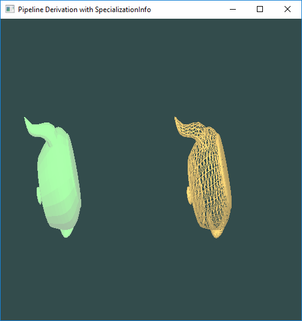

Example of how to create Graphics Pipelines using PipelineCache and Pipelines derivation flags.

Finally, this demo demonstrates the use of SPIR-V specialization constants used to specify shader constants at pipeline creation time. 

### [Earth](./Earth.cpp)
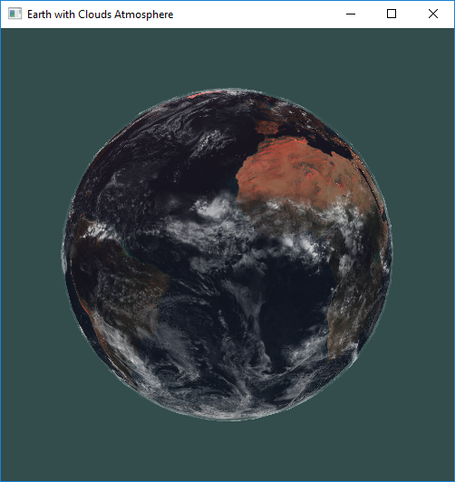

Foo

### [Cemetery Dynamic Uniform Buffer](./CementeryScene.cpp)


Foo


### [Deferred Shading](./DeferredShading.cpp)


Foo


### [MultiSetDescriptor](./MultiSetDescriptor.cpp)
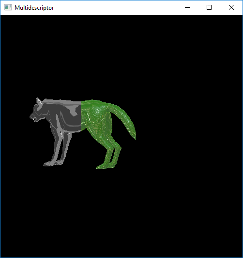

Foo


### [Stencil Toon Outline](./StencilToonOutline.cpp)
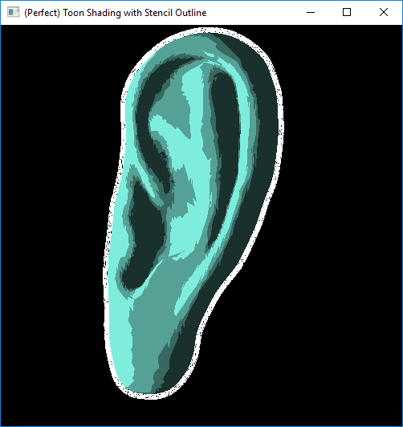

Foo


### [Swap Quad Texture](./SwapQuadTexture.cpp)
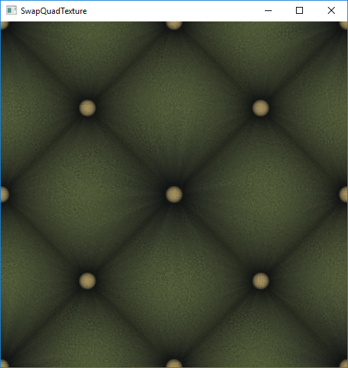

Foo

## Geometry Shader
### [Rotation 2D Figures](./GeometryFigures.cpp)
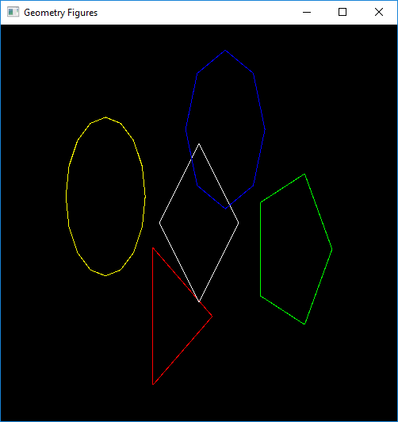

Example to demonstrate how to generate convex polygons through a geometry shader. This shader receives a list of vertices whose information contains the center of the polygon, the color and the number of sides.

### [Mesh Explosion](./MeshExplosion.cpp)
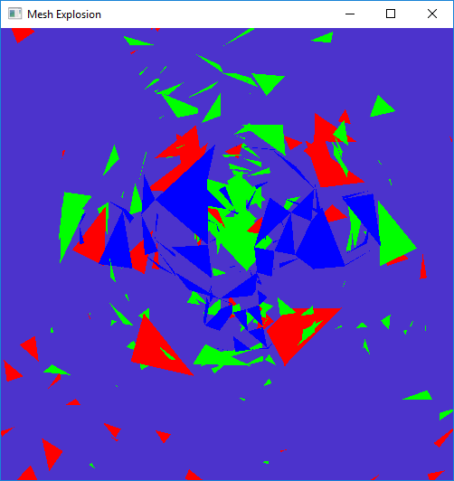

In this demo we paint a mesh whose triangles "explode" according to the normal of the triangle as if it were an explosion.

Within the geometry shader, to avoid that the triangles are lost in scene, a trigonometric function is executed to animate the different triangles that make up the mesh.

### [Mesh Normals](./MeshNormals.cpp)


TODO

### [Clip Planes](./ClipPlanes.cpp)
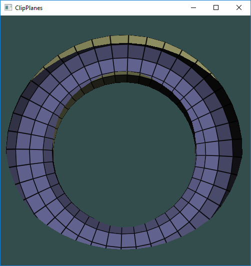

TODO

### [Billboard with Geometry Shader](./BillboardGeometry.cpp)
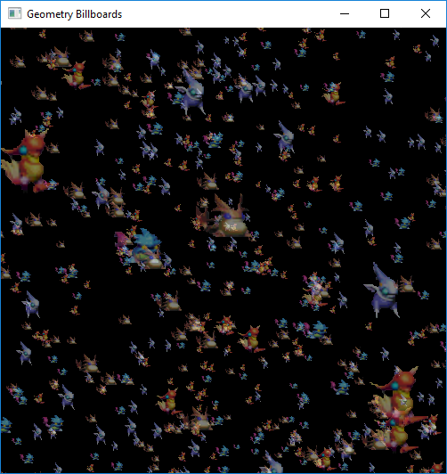

Simple example where we demonstrate how to apply the Billboard Particles technique using a geometry shader. The images used are inside a Texture2DArray.

Copyright: Golden Sun (Camelot Software Planning)

### [Butterflies in a grassland](./ButterfliesGrassland.cpp)
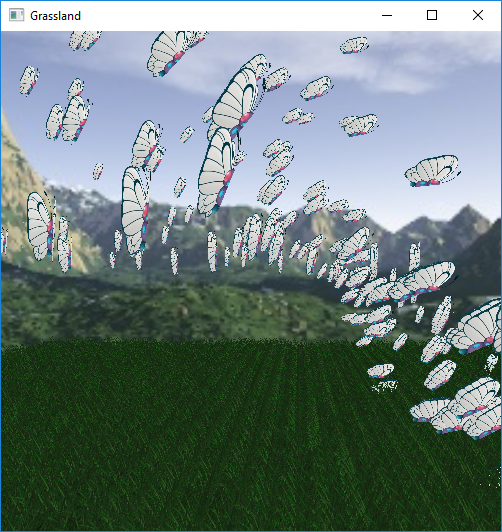

In this complete example, it shows you how to draw grass animated by the wind applying the blending functions of the Graphic Pipeline. On the other hand, a collection of butterflies based on the popular butterfly "Butterfree" of Pokémon are also drawn which flap their wings. Both the grass and the butterflies are drawn from a collection of points that mark the center of the geometries and through the Geometry stage we generate the rest of the triangles. Finally, a simple Skybox is drawn to add a better atmosphere to the scene.


### [MultiViewport Perfect Toon](./MultiViewportToon.cpp)


Foo


## Tesselations Shader
### [Heightmap with Tesselation Shader](./HeightmapTesselation.cpp)
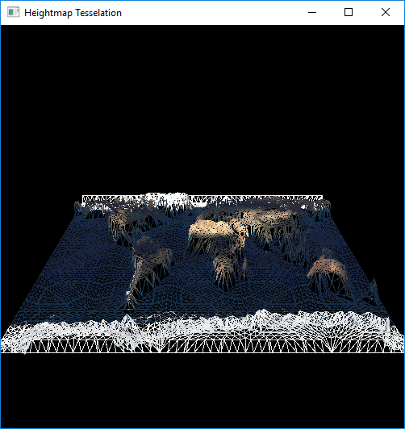

Through this example we show how to draw a plane to which the tiling shaders are applied with the drawing of a Heightmap that represents a map of the planet Earth. To represent this Heightmap two textures are used: The first represents the diffuse map of the Earth and the second represents the map of heights. Both the height and the level of tessellation are configurable through the keyboard.


## Compute Pipelines
*Compute shaders are mandatory in Vulkan and must be supported on all devices*

### [Compute copy](./ComputeCopy.cpp)


Example of how to perform a vector copy using compute shaders.


### [Compute sum](./ComputeSum.cpp)
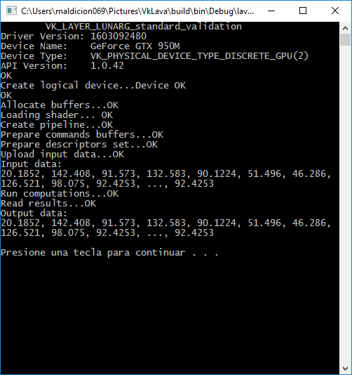

Example of how to perform mathematical operations on vectors using compute shaders.


### [Cube with computed fractal](./FractalCompute.cpp)
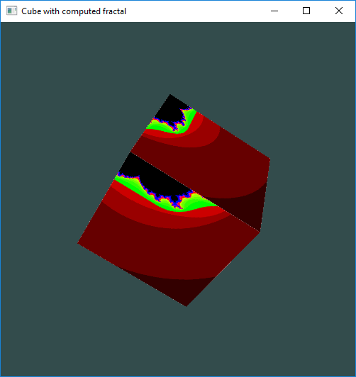

A compute shader generates a [Mandelbrot Fractal](https://en.wikipedia.org/wiki/Mandelbrot_set) and this texture is applied over a mesh.

The idea of this demo is to create a Computation Pipeline whose task is to generate a texture that represents the well-known Mandelbrot Fractal with dynamic center, that is, using a Uniform Buffer we determine in real time the center of this fractal. Finally, this texture is applied on an indexed cube that rotates.
